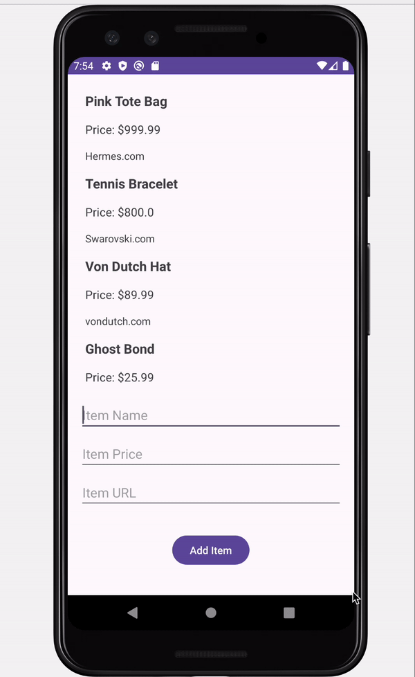

# Project 2 - *Wishlist*

Submitted by: **Evolone Layne**

**Wishlist** is an android app where the user can keep track of items that they wat to buy in the future.

Time spent: **2** hours spent in total

## Required Features

The following **required** functionality is completed:

* [x] User can add an item to the wishlist
* [x] User can see their list of items based on previously inputted items

The following **optional** features are implemented:

* [ ] Wishlist app is 🎨 customized 🎨
* [ ] User can delete an item by long pressing on the item
* [ ] User can open the an item URL by clicking on an item

## Video Walkthrough

Here's a walkthrough of implemented features:

<!-- Replace this with whatever GIF tool you used! -->
GIF created with Ezgif   
<!-- Recommended tools:
[Kap](https://getkap.co/) for macOS
[ScreenToGif](https://www.screentogif.com/) for Windows
[peek](https://github.com/phw/peek) for Linux. -->

## Notes

Describe any challenges encountered while building the app.

## License

    Copyright [2023] [Evolone Layne]

    Licensed under the Apache License, Version 2.0 (the "License");
    you may not use this file except in compliance with the License.
    You may obtain a copy of the License at

        http://www.apache.org/licenses/LICENSE-2.0

    Unless required by applicable law or agreed to in writing, software
    distributed under the License is distributed on an "AS IS" BASIS,
    WITHOUT WARRANTIES OR CONDITIONS OF ANY KIND, either express or implied.
    See the License for the specific language governing permissions and
    limitations under the License.
